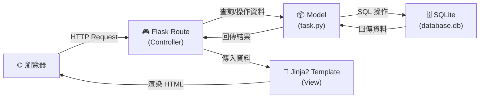
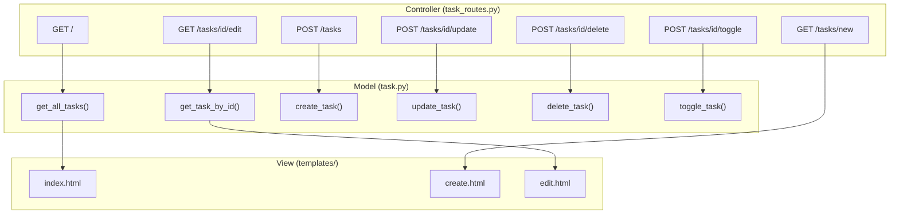

# 任務管理系統 — 系統架構文件

> **文件版本：** v1.0
> **建立日期：** 2026-04-09
> **對應 PRD：** [docs/PRD.md](./PRD.md)

---

## 1. 技術架構說明

### 1.1 選用技術與原因

| 技術 | 用途 | 選用原因 |
|------|------|---------|
| **Python 3** | 程式語言 | 語法簡潔易學，適合大學專題開發，社群資源豐富 |
| **Flask** | 後端框架 | 輕量級微框架，學習曲線低，適合中小型專案 |
| **Jinja2** | 模板引擎 | Flask 內建支援，可直接在 HTML 中嵌入 Python 邏輯 |
| **SQLite** | 資料庫 | 無需額外安裝資料庫伺服器，檔案式儲存，適合單機開發 |
| **HTML + CSS + JS** | 前端 | 原生技術，無需額外框架，降低複雜度 |

### 1.2 Flask MVC 模式說明

本專案採用 **MVC（Model-View-Controller）** 架構模式，將程式邏輯分為三個層次：

```
┌─────────────────────────────────────────────────────────┐
│                      MVC 架構概覽                        │
├──────────────┬──────────────────┬────────────────────────┤
│   Model      │   View           │   Controller           │
│  (資料模型)   │  (使用者介面)     │   (業務邏輯)            │
├──────────────┼──────────────────┼────────────────────────┤
│ 定義資料結構  │ Jinja2 HTML 模板  │ Flask 路由函式          │
│ 操作資料庫    │ 呈現資料給使用者   │ 接收請求、呼叫 Model   │
│ CRUD 邏輯    │ 表單收集使用者輸入 │ 傳遞資料給 View 渲染   │
├──────────────┼──────────────────┼────────────────────────┤
│ app/models/  │ app/templates/   │ app/routes/            │
└──────────────┴──────────────────┴────────────────────────┘
```

**運作流程：**
1. 使用者在瀏覽器發送 HTTP 請求
2. **Controller**（Flask Route）接收請求，決定要執行什麼邏輯
3. Controller 呼叫 **Model** 進行資料庫操作（查詢、新增、修改、刪除）
4. Controller 將結果傳遞給 **View**（Jinja2 模板）進行頁面渲染
5. 渲染完成的 HTML 回傳給瀏覽器顯示

---

## 2. 專案資料夾結構

```
web_app_development/
│
├── app.py                  ← 應用程式入口，啟動 Flask 伺服器
├── config.py               ← 應用程式設定（資料庫路徑、密鑰等）
├── requirements.txt        ← Python 套件依賴清單
│
├── app/                    ← 主要應用程式目錄
│   ├── __init__.py         ← Flask App 工廠函式，初始化應用程式
│   │
│   ├── models/             ← Model 層：資料庫模型
│   │   ├── __init__.py
│   │   └── task.py         ← Task 資料模型（定義任務的資料結構與 CRUD 操作）
│   │
│   ├── routes/             ← Controller 層：Flask 路由
│   │   ├── __init__.py
│   │   └── task_routes.py  ← 任務相關路由（新增、編輯、刪除、列表、狀態切換）
│   │
│   ├── templates/          ← View 層：Jinja2 HTML 模板
│   │   ├── base.html       ← 基礎模板（共用的 header、footer、導覽列）
│   │   ├── index.html      ← 任務列表頁（首頁）
│   │   ├── create.html     ← 新增任務頁
│   │   └── edit.html       ← 編輯任務頁
│   │
│   └── static/             ← 靜態資源
│       ├── css/
│       │   └── style.css   ← 全站樣式表
│       └── js/
│           └── main.js     ← 前端互動邏輯（刪除確認、狀態切換等）
│
├── instance/               ← 實例資料夾（不進版控）
│   └── database.db         ← SQLite 資料庫檔案
│
├── docs/                   ← 專案文件
│   ├── PRD.md              ← 產品需求文件
│   └── ARCHITECTURE.md     ← 系統架構文件（本文件）
│
└── .gitignore              ← Git 忽略規則
```

### 各目錄職責說明

| 目錄 / 檔案 | 職責 |
|-------------|------|
| `app.py` | 應用程式入口點，負責建立與啟動 Flask 應用 |
| `config.py` | 集中管理設定值（如資料庫路徑、SECRET_KEY） |
| `app/__init__.py` | App 工廠函式，初始化 Flask、註冊 Blueprint、建立資料庫 |
| `app/models/` | 定義資料表結構與資料庫操作函式（CRUD） |
| `app/routes/` | 定義 URL 路由與對應的處理邏輯（Controller） |
| `app/templates/` | 存放 Jinja2 HTML 模板，負責頁面呈現 |
| `app/static/` | 存放 CSS、JavaScript 等靜態檔案 |
| `instance/` | 存放 SQLite 資料庫，此目錄應加入 `.gitignore` |

---

## 3. 元件關係圖

### 3.1 整體請求流程



### 3.2 功能對應元件



### 3.3 資料流向圖

```
使用者操作              Flask Route              Model                SQLite
─────────              ───────────              ─────                ──────
  │                        │                      │                    │
  │── 瀏覽任務列表 ──────→│── get_all_tasks() ──→│── SELECT * ──────→│
  │                        │                      │←── 回傳資料 ──────│
  │                        │←── 任務清單 ─────────│                    │
  │←── 渲染 index.html ───│                      │                    │
  │                        │                      │                    │
  │── 新增任務 ──────────→│── create_task() ────→│── INSERT ────────→│
  │←── 重導至列表 ────────│                      │                    │
  │                        │                      │                    │
  │── 編輯任務 ──────────→│── update_task() ────→│── UPDATE ────────→│
  │←── 重導至列表 ────────│                      │                    │
  │                        │                      │                    │
  │── 刪除任務 ──────────→│── delete_task() ────→│── DELETE ────────→│
  │←── 重導至列表 ────────│                      │                    │
  │                        │                      │                    │
  │── 切換完成狀態 ──────→│── toggle_task() ────→│── UPDATE ────────→│
  │←── 重導至列表 ────────│                      │                    │
```

---

## 4. 關鍵設計決策

### 決策一：使用 App 工廠模式（Application Factory）

**選擇：** 在 `app/__init__.py` 中使用 `create_app()` 函式建立 Flask 實例

**原因：**
- 避免循環引用問題
- 方便未來擴充（如新增測試配置）
- 是 Flask 官方推薦的最佳實踐

### 決策二：使用 Blueprint 組織路由

**選擇：** 將路由定義在 `app/routes/` 下，以 Flask Blueprint 註冊

**原因：**
- 將路由邏輯與應用初始化分離，程式碼更清晰
- 當功能增加時，可輕鬆新增新的 Blueprint（如未來加入使用者模組）
- 便於團隊分工，不同成員可負責不同 Blueprint

### 決策三：使用原生 sqlite3 而非 ORM

**選擇：** 透過 Python 內建的 `sqlite3` 模組操作資料庫，不使用 SQLAlchemy 等 ORM

**原因：**
- 減少額外依賴，降低學習成本
- 讓團隊成員直接學習 SQL 語法
- 對於本專案規模（單一資料表），ORM 的抽象層反而增加複雜度

### 決策四：伺服器端渲染（SSR）而非前後端分離

**選擇：** 使用 Flask + Jinja2 進行伺服器端頁面渲染，不採用前後端分離架構

**原因：**
- 減少技術棧複雜度（不需要學習 React/Vue 等前端框架）
- 所有邏輯集中在 Flask，部署與除錯更簡單
- 對於大學專題的規模，SSR 完全足夠

### 決策五：使用 POST + 重導向模式處理表單

**選擇：** 表單提交使用 POST 方法，處理完成後以 `redirect()` 重導回列表頁

**原因：**
- 遵循 PRG（Post-Redirect-Get）模式，避免使用者重新整理頁面時重複提交
- 符合 HTTP 語義，GET 用於讀取、POST 用於寫入
- 降低前端 JavaScript 的複雜度

---

> **下一步：** 架構確認後，可進入資料庫設計（`/db-design`）與 API 路由設計（`/api-design`）階段。
