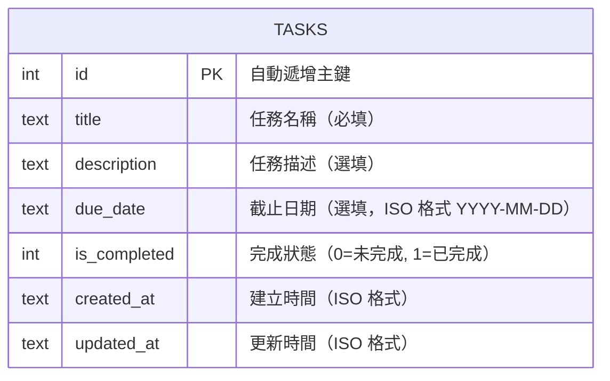

# 任務管理系統 — 資料庫設計文件

> **文件版本：** v1.0
> **建立日期：** 2026-04-16
> **對應文件：** [docs/PRD.md](./PRD.md) ｜ [docs/FLOWCHART.md](./FLOWCHART.md) ｜ [docs/ARCHITECTURE.md](./ARCHITECTURE.md)

---

## 1. ER 圖（實體關係圖）

本專案為單一資料表設計，因任務管理系統的 MVP 版本僅需一個 `tasks` 資料表來存放所有任務資料。



---

## 2. 資料表詳細說明

### 2.1 tasks — 任務資料表

儲存所有使用者建立的任務，支援新增、編輯、刪除、標記完成等操作。

| 欄位名稱 | 資料型別 | 必填 | 預設值 | 說明 |
|----------|---------|------|--------|------|
| `id` | INTEGER | 是 | 自動遞增 | 主鍵（Primary Key），唯一識別每筆任務 |
| `title` | TEXT | 是 | — | 任務名稱，不可為空 |
| `description` | TEXT | 否 | `''`（空字串） | 任務描述，補充說明任務內容 |
| `due_date` | TEXT | 否 | `NULL` | 截止日期，格式為 `YYYY-MM-DD`（ISO 8601） |
| `is_completed` | INTEGER | 是 | `0` | 完成狀態：`0` 表示未完成，`1` 表示已完成 |
| `created_at` | TEXT | 是 | 當前時間 | 任務建立時間，格式為 ISO 8601（`YYYY-MM-DD HH:MM:SS`） |
| `updated_at` | TEXT | 是 | 當前時間 | 最後更新時間，每次修改時自動更新 |

### 2.2 設計考量

| 項目 | 說明 |
|------|------|
| **主鍵策略** | 使用 `INTEGER PRIMARY KEY AUTOINCREMENT`，確保 ID 唯一且自動遞增 |
| **時間格式** | 使用 `TEXT` 儲存 ISO 格式時間，SQLite 不支援原生 DATETIME 型別 |
| **完成狀態** | 使用 `INTEGER`（0/1）模擬布林值，SQLite 無原生 BOOLEAN 型別 |
| **截止日期** | 允許為 `NULL`（選填），方便沒有明確截止日的任務 |
| **軟刪除** | MVP 版本不實作軟刪除，直接從資料庫 DELETE |

---

## 3. SQL 建表語法

完整的 SQL 建表語法存放於 `database/schema.sql`：

```sql
CREATE TABLE IF NOT EXISTS tasks (
    id          INTEGER PRIMARY KEY AUTOINCREMENT,
    title       TEXT    NOT NULL,
    description TEXT    DEFAULT '',
    due_date    TEXT    DEFAULT NULL,
    is_completed INTEGER DEFAULT 0,
    created_at  TEXT    NOT NULL DEFAULT (datetime('now', 'localtime')),
    updated_at  TEXT    NOT NULL DEFAULT (datetime('now', 'localtime'))
);
```

---

## 4. Python Model 方法對照

Model 程式碼存放於 `app/models/task.py`，提供以下 CRUD 方法：

| 方法名稱 | SQL 操作 | 對應功能 | 說明 |
|----------|---------|---------|------|
| `create(title, description, due_date)` | `INSERT` | F-01 新增任務 | 建立新任務並回傳新建任務資料 |
| `get_all(status_filter)` | `SELECT` | F-06 任務列表與篩選 | 取得所有任務，支援依完成狀態篩選，依截止日期排序 |
| `get_by_id(task_id)` | `SELECT` | — | 依 ID 取得單筆任務 |
| `update(task_id, title, description, due_date)` | `UPDATE` | F-02 編輯任務 | 更新指定任務的欄位 |
| `delete(task_id)` | `DELETE` | F-03 刪除任務 | 刪除指定任務 |
| `toggle_completed(task_id)` | `UPDATE` | F-04 標記完成狀態 | 切換完成/未完成狀態 |

---

## 5. 資料範例

| id | title | description | due_date | is_completed | created_at | updated_at |
|----|-------|------------|----------|-------------|-----------|-----------|
| 1 | 完成資料庫報告 | 第三章節需要補充圖表 | 2026-04-20 | 0 | 2026-04-16 10:30:00 | 2026-04-16 10:30:00 |
| 2 | 複習期中考 | 線性代數 Ch1~Ch5 | 2026-04-18 | 0 | 2026-04-16 11:00:00 | 2026-04-16 11:00:00 |
| 3 | 繳交社團企劃書 | | 2026-04-15 | 1 | 2026-04-10 09:00:00 | 2026-04-15 14:30:00 |

---

> **下一步：** 資料庫設計確認後，可進入 API 路由設計（`/api-design`）階段，規劃每個頁面的 URL、HTTP 方法與對應邏輯。
