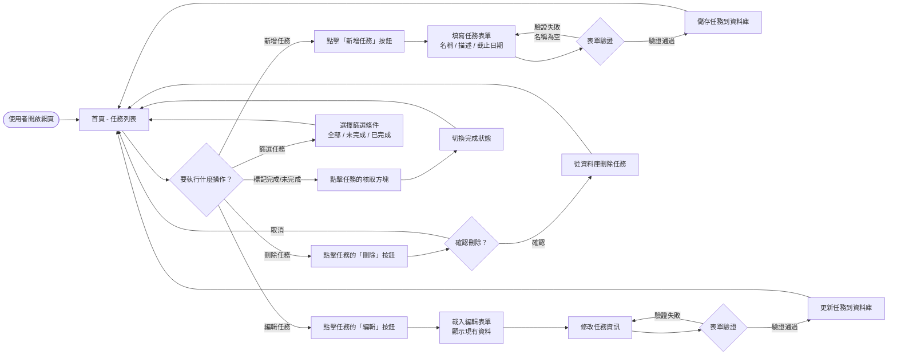
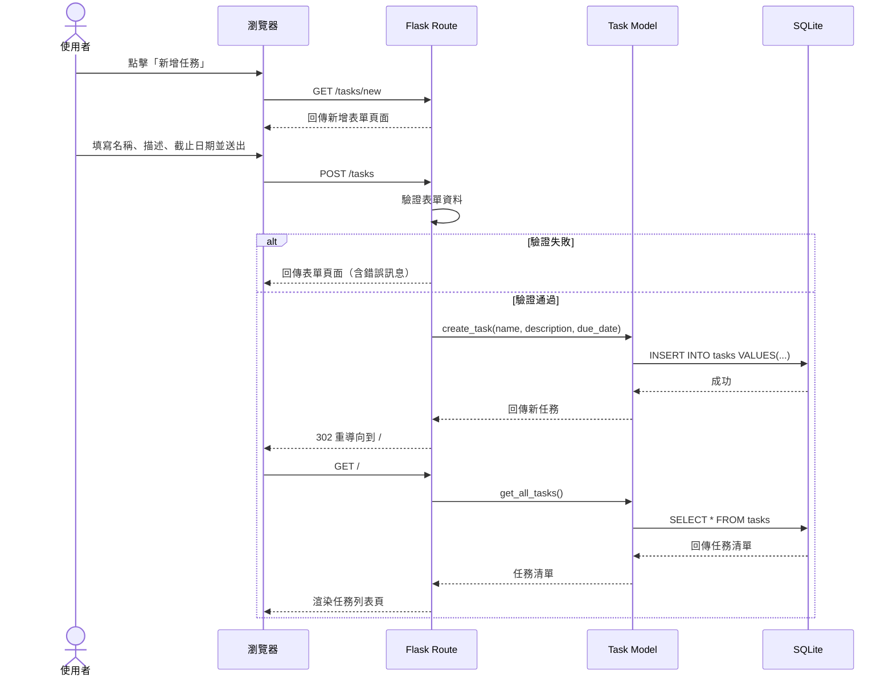
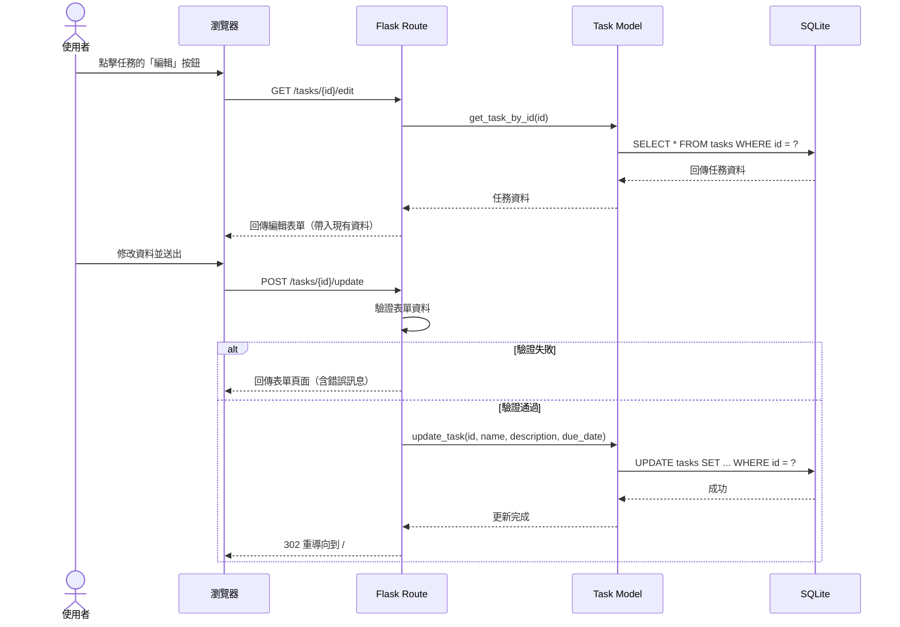
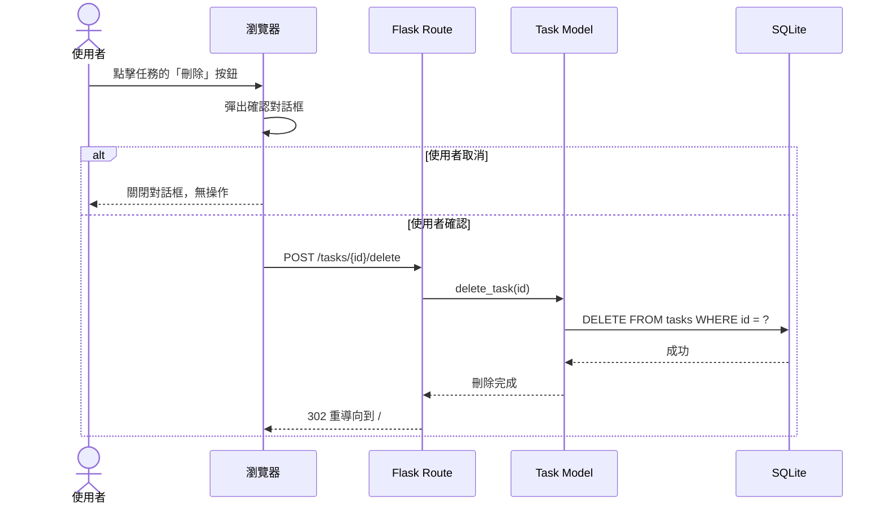
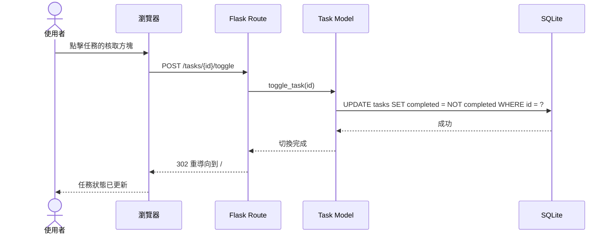

# 任務管理系統 — 流程圖文件

> **文件版本：** v1.0
> **建立日期：** 2026-04-09
> **對應文件：** [docs/PRD.md](./PRD.md) ｜ [docs/ARCHITECTURE.md](./ARCHITECTURE.md)

---

## 1. 使用者流程圖（User Flow）

以下流程圖描述使用者從進入網站到完成各項操作的完整路徑：

### 流程說明

| 步驟 | 說明 |
|------|------|
| **進入首頁** | 使用者開啟網頁後，自動顯示所有任務列表 |
| **新增任務** | 點擊新增 → 填寫表單 → 驗證 → 儲存 → 回到列表 |
| **編輯任務** | 點擊編輯 → 載入現有資料 → 修改 → 驗證 → 更新 → 回到列表 |
| **刪除任務** | 點擊刪除 → 確認提示 → 確認後刪除 → 回到列表 |
| **標記完成** | 點擊核取方塊 → 即時切換狀態 → 列表更新 |
| **篩選任務** | 選擇篩選條件 → 列表重新載入對應任務 |

---

## 2. 系統序列圖（Sequence Diagram）

### 2.1 新增任務流程

### 2.2 編輯任務流程

### 2.3 刪除任務流程

### 2.4 切換完成狀態流程

---

## 3. 功能清單對照表

| 功能 | URL 路徑 | HTTP 方法 | 說明 |
|------|---------|-----------|------|
| 瀏覽任務列表 | `/` | `GET` | 首頁，顯示所有任務，支援篩選 |
| 新增任務頁面 | `/tasks/new` | `GET` | 顯示新增任務的表單 |
| 提交新任務 | `/tasks` | `POST` | 接收表單資料，建立新任務 |
| 編輯任務頁面 | `/tasks/<id>/edit` | `GET` | 顯示編輯表單，帶入現有資料 |
| 更新任務 | `/tasks/<id>/update` | `POST` | 接收表單資料，更新任務 |
| 刪除任務 | `/tasks/<id>/delete` | `POST` | 刪除指定任務 |
| 切換完成狀態 | `/tasks/<id>/toggle` | `POST` | 切換任務的完成 / 未完成狀態 |

---

> **下一步：** 流程圖確認後，可進入資料庫設計（`/db-design`）階段，定義 SQLite 資料表結構。
