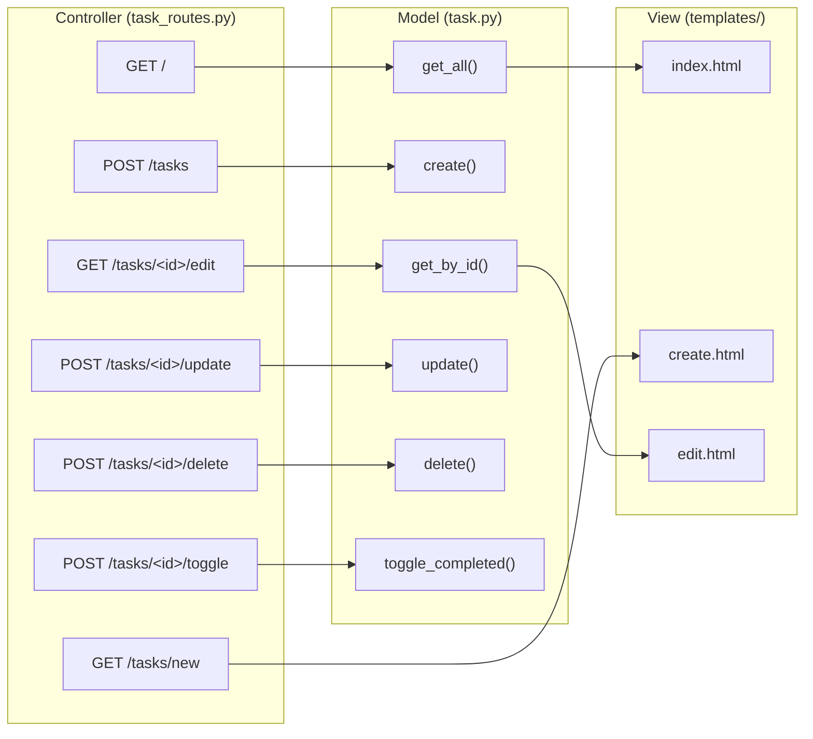

# 任務管理系統 — 路由設計文件

> **文件版本：** v1.0
> **建立日期：** 2026-04-16
> **對應文件：** [docs/PRD.md](./PRD.md) ｜ [docs/ARCHITECTURE.md](./ARCHITECTURE.md) ｜ [docs/DB_DESIGN.md](./DB_DESIGN.md)

---

## 1. 路由總覽表格

| 功能 | HTTP 方法 | URL 路徑 | 對應模板 | 說明 |
|------|-----------|---------|---------|------|
| 任務列表（首頁） | `GET` | `/` | `index.html` | 顯示所有任務清單，支援篩選 |
| 新增任務頁面 | `GET` | `/tasks/new` | `create.html` | 顯示新增任務表單 |
| 建立任務 | `POST` | `/tasks` | — | 接收表單資料，存入資料庫，重導向至首頁 |
| 編輯任務頁面 | `GET` | `/tasks/<id>/edit` | `edit.html` | 顯示編輯表單，帶入現有任務資料 |
| 更新任務 | `POST` | `/tasks/<id>/update` | — | 接收表單資料，更新資料庫，重導向至首頁 |
| 刪除任務 | `POST` | `/tasks/<id>/delete` | — | 刪除指定任務，重導向至首頁 |
| 切換完成狀態 | `POST` | `/tasks/<id>/toggle` | — | 切換任務完成/未完成，重導向至首頁 |

---

## 2. 每個路由的詳細說明

### 2.1 任務列表（首頁）

| 項目 | 說明 |
|------|------|
| **URL** | `GET /` |
| **功能編號** | F-06 任務列表與篩選、F-07 到期提醒標示 |
| **輸入** | Query Parameter: `filter`（可選，值為 `all` / `active` / `completed`） |
| **處理邏輯** | 呼叫 `task.get_all(db_path, status_filter)` 取得任務清單 |
| **輸出** | 渲染 `index.html`，傳入 `tasks`（任務清單）與 `current_filter`（當前篩選條件） |
| **錯誤處理** | 無特殊錯誤情境 |

**模板需要的資料：**

```python
{
    'tasks': [...],           # 任務清單（list of dict）
    'current_filter': 'all'   # 目前的篩選條件
}
```

---

### 2.2 新增任務頁面

| 項目 | 說明 |
|------|------|
| **URL** | `GET /tasks/new` |
| **功能編號** | F-01 新增任務 |
| **輸入** | 無 |
| **處理邏輯** | 無資料庫操作 |
| **輸出** | 渲染 `create.html`，顯示空白表單 |
| **錯誤處理** | 無 |

---

### 2.3 建立任務

| 項目 | 說明 |
|------|------|
| **URL** | `POST /tasks` |
| **功能編號** | F-01 新增任務、F-05 設定截止日期 |
| **輸入** | 表單欄位：`title`（必填）、`description`（選填）、`due_date`（選填） |
| **處理邏輯** | 1. 驗證 `title` 不為空<br>2. 呼叫 `task.create(db_path, title, description, due_date)` |
| **輸出** | 成功：`redirect('/')` 重導向至首頁 |
| **錯誤處理** | `title` 為空時：重新渲染 `create.html`，傳入錯誤訊息與使用者已輸入的資料 |

**驗證失敗時傳入模板的資料：**

```python
{
    'error': '任務名稱為必填欄位',
    'form_data': {
        'title': '',
        'description': '...',
        'due_date': '...'
    }
}
```

---

### 2.4 編輯任務頁面

| 項目 | 說明 |
|------|------|
| **URL** | `GET /tasks/<id>/edit` |
| **功能編號** | F-02 編輯任務 |
| **輸入** | URL 參數：`id`（任務 ID） |
| **處理邏輯** | 呼叫 `task.get_by_id(db_path, id)` 取得任務資料 |
| **輸出** | 渲染 `edit.html`，傳入 `task`（任務資料） |
| **錯誤處理** | 任務不存在時：回傳 404 頁面 |

**模板需要的資料：**

```python
{
    'task': {
        'id': 1,
        'title': '...',
        'description': '...',
        'due_date': '...',
        ...
    }
}
```

---

### 2.5 更新任務

| 項目 | 說明 |
|------|------|
| **URL** | `POST /tasks/<id>/update` |
| **功能編號** | F-02 編輯任務、F-05 設定截止日期 |
| **輸入** | URL 參數：`id`；表單欄位：`title`（必填）、`description`（選填）、`due_date`（選填） |
| **處理邏輯** | 1. 驗證 `title` 不為空<br>2. 呼叫 `task.update(db_path, id, title, description, due_date)` |
| **輸出** | 成功：`redirect('/')` 重導向至首頁 |
| **錯誤處理** | `title` 為空時：重新渲染 `edit.html`，傳入錯誤訊息與現有任務資料<br>任務不存在時：回傳 404 頁面 |

---

### 2.6 刪除任務

| 項目 | 說明 |
|------|------|
| **URL** | `POST /tasks/<id>/delete` |
| **功能編號** | F-03 刪除任務 |
| **輸入** | URL 參數：`id`（任務 ID） |
| **處理邏輯** | 呼叫 `task.delete(db_path, id)` |
| **輸出** | `redirect('/')` 重導向至首頁 |
| **錯誤處理** | 任務不存在時：仍重導向至首頁（靜默處理） |

> **注意：** 刪除確認在前端以 JavaScript `confirm()` 對話框實作，不經過後端。

---

### 2.7 切換完成狀態

| 項目 | 說明 |
|------|------|
| **URL** | `POST /tasks/<id>/toggle` |
| **功能編號** | F-04 標記完成狀態 |
| **輸入** | URL 參數：`id`（任務 ID） |
| **處理邏輯** | 呼叫 `task.toggle_completed(db_path, id)` |
| **輸出** | `redirect('/')` 重導向至首頁 |
| **錯誤處理** | 任務不存在時：仍重導向至首頁（靜默處理） |

---

## 3. Jinja2 模板清單

所有模板存放於 `app/templates/` 目錄，繼承自 `base.html` 基礎模板。

| 模板檔案 | 繼承自 | 用途 | 對應路由 |
|----------|--------|------|---------|
| `base.html` | — | 基礎模板，包含 HTML 骨架、導覽列、CSS/JS 引入 | — |
| `index.html` | `base.html` | 任務列表頁（首頁），含篩選功能與到期提醒標示 | `GET /` |
| `create.html` | `base.html` | 新增任務表單頁面 | `GET /tasks/new` |
| `edit.html` | `base.html` | 編輯任務表單頁面 | `GET /tasks/<id>/edit` |

### 模板區塊（Blocks）規劃

`base.html` 定義以下區塊，供子模板覆寫：

| 區塊名稱 | 用途 |
|----------|------|
| `` | 頁面標題 |
| `` | 主要內容區域 |

---

## 4. 路由對應 Model 方法對照



---

## 5. 靜態資源規劃

| 檔案 | 路徑 | 用途 |
|------|------|------|
| `style.css` | `app/static/css/style.css` | 全站樣式（響應式排版、到期顏色標示、完成狀態樣式） |
| `main.js` | `app/static/js/main.js` | 前端互動邏輯（刪除確認對話框、核取方塊狀態切換） |

---

> **下一步：** 路由設計確認後，可進入實作階段（`/implementation`），逐一完成路由、模板與前端邏輯。
